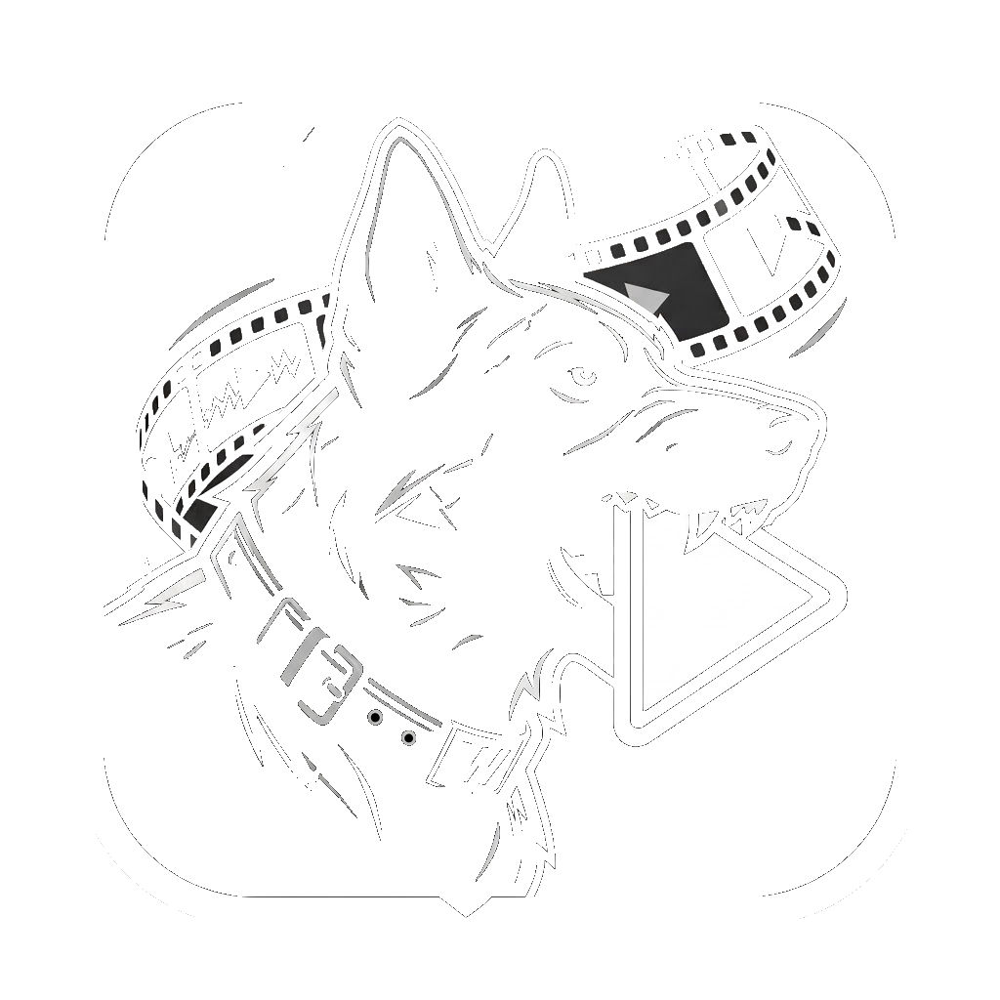



# 🎯 Clips KillFeed Wardogs
### *Detector Inteligente de Bajas por IA y Editor Automático de Clips*

**[🇪🇸 Español](#-español) | [🇬🇧 English](#-english)**

---

## 🇪🇸 Español

### ¿Qué es Clips KillFeed Wardogs?
Una herramienta de escritorio diseñada para streamers y jugadores de **Wardogs** que quieren ahorrar horas revisando directos y grabaciones de OBS. 

La IA analiza tus vídeos, detecta cuándo eliminas a un enemigo en el Killfeed, mide la distancia exacta, evalúa tus gritos/euforia en el micrófono y genera clips automáticos en **16:9 (Horizontal)** y **9:16 (Shorts / TikTok con fondo desenfocado cinematográfico)**.

### ✨ Características Principales
- 🧠 **Detección OCR por IA Local:** Reconoce tu Gamertag en el Killfeed con nombre de víctima y distancia ([45m]).
- 🎙️ **Score de Hype y Gritos:** Análisis RMS del micrófono para clasificar jugadas épicas con ⭐⭐⭐⭐⭐.
- 📱 **Recorte Dual:** Guarda clips en 16:9 y formato vertical 9:16 listo para TikTok, Shorts y Reels.
- 🎬 **Montaje Supercut:** Une todas tus bajas en un solo vídeo recopilatorio de Highlights sin recodificar.
- 📊 **Reporte HTML:** Exporta un resumen visual interactivo con estadísticas para abrir en Google Chrome.
- 🌐 **100% Bilingüe:** Interfaz conmutable entre Español e Inglés en tiempo real.

### 🚀 Instalación y Uso

#### Opción A: Descarga Portable (.EXE) — *Recomendado para usuarios*
1. Ve a la sección de **[Releases](../../releases)** del repositorio.
2. Descarga el archivo Clips KillFeed Wardogs (Portable).zip.
3. Descomprímelo y haz doble clic en Clips KillFeed Wardogs.exe. *(No requiere instalar nada)*.

#### Opción B: Ejecutar desde Código Fuente (Python)
`ash
# 1. Clonar repositorio
git clone https://github.com/TU_USUARIO/Clips-KillFeed-Wardogs.git
cd Clips-KillFeed-Wardogs

# 2. Instalar dependencias
pip install -r requirements.txt

# 3. Iniciar la aplicación
python AutoClip_AI.py
`

---

## 🇬🇧 English

### What is Clips KillFeed Wardogs?
A desktop utility crafted for **Wardogs** streamers and players who don't want to waste hours scrubbing through 4-hour OBS VODs.

Local AI analyzes your recordings, spots whenever you eliminate an enemy in the killfeed, tracks distance, scores your voice hype/celebrations from your mic, and renders instant clips in **16:9 Landscape** and **9:16 Portrait Shorts (with cinematic blurred background)**.

### ✨ Features
- 🧠 **Local OCR AI:** High-speed killfeed parsing (killer, victim, distance in meters).
- 🎙️ **Hype & Scream Detection:** Microphone RMS energy analysis rating hype plays with ⭐⭐⭐⭐⭐.
- 📱 **Dual Format Clipping:** 16:9 widescreen + 9:16 vertical TikTok/Shorts with background blur.
- 🎬 **Batch Export & Supercut Montage:** Export separate clips or concatenate them into one montage without quality loss.
- 📊 **HTML Dashboard Report:** Generate a clean web report opened in Chrome with full match stats.
- 🌐 **Bilingual UI:** Instant toggle between English and Spanish.

---

## 📜 Créditos & Meme / Credits
> **Idea, diseño y dirección:** [ICayon](https://x.com/ICayonh)  
> **Código picado bajo estricta explotación laboral por mis becarios de IA:** Gemini & Claude 🤖☕

---

## 📄 Licencia / License
Distribuido bajo la licencia [MIT](LICENSE).